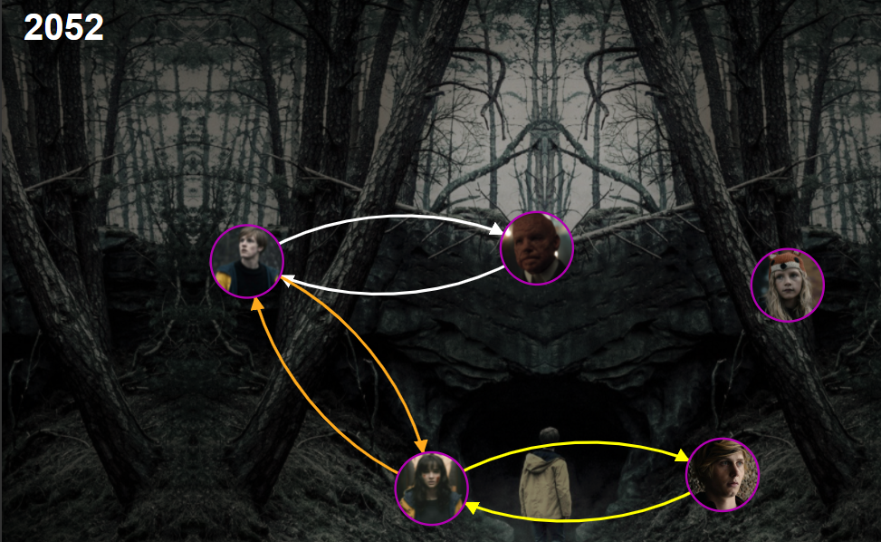
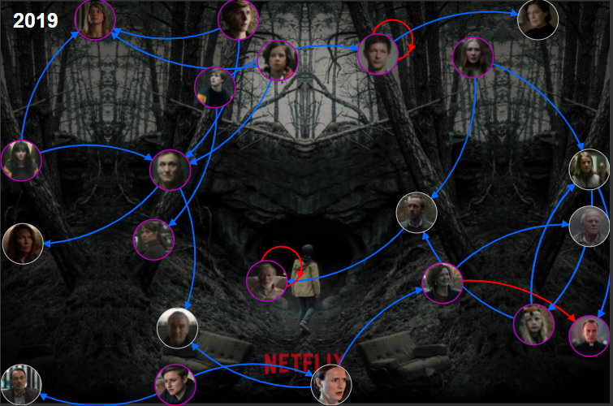
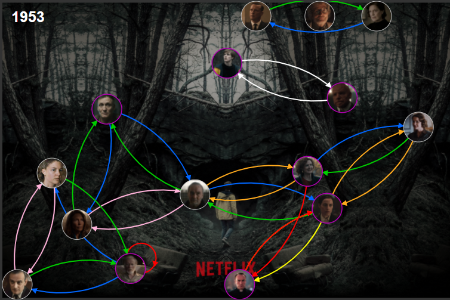

# Dark-netflix-graph

Dominio
------------
Il dominio scelto per la realizzazione del Secondo Progetto di INFOVIS 20/21 è la serie TV Dark targata Netflix. La scelta di questo dominio deriva principalmente dalla nostra esperienza di spettatori, in quanto abbiamo notato quanto sia difficile comprendere questo titolo senza l'ausilio di un interfaccia grafica che permetta ad un utente di ricostruire visivamente tutti gli intrecci di trama presenti nella serie. Inoltre prima di procedere con l'effettiva costruzione dell'interfaccia grafica abbiamo chiesto anche  ad altri utenti (spettatori della serie) come attualmente risolvevano il problema e abbiamo notato che attualmente il web non offre interfacce interattive ma solo immagini statiche. A seguitò di ciò, abbiamo deciso di provare a realizzare un interfaccia, in particolare un grafo, che riesca ad aiutare gli utenti a capire al meglio la trama offerta da Baran bo Odar, ideatore e regista di Dark.

Obiettivo 
------------
Gli obiettivi del grafo sono stati delinati attraverso due canali: 
1. In primo luogo a seguito di un brainstorming avvenuto tra gli sviluppatori dell'interfaccia, essendo anche noi spetttatori della serie, abbiamo provato a delineare le difficoltà maggiori che un utente incontra durante la visione di Dark. 
 
2. Successivamente a seguito di una prima implementazione, abbiamo deciso di utilizzare un secondo canale per definire quali fossero altri problemi legati alla comprensione della trama. Abbiamo quindi realizzato un google form, nel quale è stato richiesto ad alcuni utenti spettatori della serie TV di aiutarci a definire quali fossero le loro difficoltà nella compresione della trama. Le soluzioni ottenute sono state analizzate e confrontate con le nostre ipotesi iniziali, e successivamente implementate nella nostra interfaccia grafica.
 
Requisiti
------------
Questo progetto richiede 2 moduli facoltativi:

Libreria D3.js (https://d3js.org/)

Il gestore NPM (https://www.npmjs.com/)

Nella soluzione proposta non abbiamo bisogno del primo modulo perchè le libreria viene importata direttamente dall'html
mentre il secondo viene utilizzato per runnare il server con il comando http-server. 

Come utilizzare
------------
Per utilizzarlo bisogna navigare fino cartella dove si trova il file "index.html" dal terminale. Successivamente runnare il comando http-server (dopo averlo installato con il comando npm install -g http-server) e aprile il proprio browser di riferimento su "http://localhost:8080/" (Testato sia su Chrome che su Firefox).

L'utente può interagire con l'interfaccia grafica in diversi mod con bottoni e checkbox presenti nell'header, in particolare:

1. L'utente può selezionare tra le 9 relazioni disponibili tramite delle checkbox. Le selezioni NON sono esclusive.

2. L'utente può scegliere tra i 4 anni in cui si sviluppa la serie, cliccando su uno di essi veranno mostrati solo i personaggi presenti in quell'anno. Le selezioni sono esclusive. Il bottone "ALL" mostra tutti i personaggi in tutti gli anni.

3. L'utente può interagire consultando la legenda dei nodi e successivamente cercare nel grafo i nodi con il bordo viola per sapere chi sono i personaggi "Time Traveller"
 
4. L'utente può interagire direttamente dal grafo cliccando con il tasto sinistro del mouse sui nodi per visualizzare i vari attori di un singolo personaggio tra le varie epoche.
 
5. L'utente può scegliere tra le 4 famiglie principali presenti nella serie TV, mostrando cosi solo i personaggi relativi a quella famiglia. Le selezioni NON sono esclusive.
 

Examples 
------------
### Filtering Interface 

### Esempio 1 

### Esempio 2

### Esempio 3 

Maintainers
------------
- Matteo Brandetti
- Gianluca De Angelis
- Pier Vincenzo De Lellis
